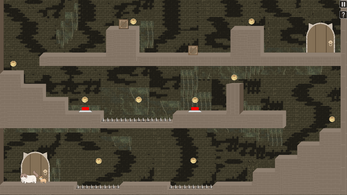

# Moi & Bolly
A 2D puzzle-platformer game about teamwork, exploration, and two very different cats trying to escape an ancient temple.

## Team Project
This project was developed as part of a team during the MSIB program.  
I contributed as Game Designer, Project Manager, and Programmer.

## Play the Game
👉 https://moibolly.itch.io/moi-bolly  

---

## Overview
Moi & Bolly is a 2D indie puzzle-platformer where players control two cats with contrasting personalities trapped inside a mysterious Mayan temple.

Moi is a lazy, chubby cat, while Bolly is small, energetic, and agile. To escape, both characters must work together to solve environmental puzzles, collect coins, and unlock the exit door in each level.

This project was developed as part of the MSIB Game Design and Development program using Unity.

---

## Game Concept
The core idea of Moi & Bolly is **cooperative problem-solving**, even in single-device gameplay.

Players must:
- Control two characters
- Use their positioning strategically
- Stack characters to reach higher platforms
- Interact with the environment to progress

---

## Gameplay Features
- 2D platformer movement (left, right, jump)
- Character stacking mechanic (inspired by cooperative puzzle games)
- Environmental puzzles using:
  - Pressure buttons to move platforms
  - Pushable boxes
  - Vertical platform challenges
- Coin collection system to unlock hidden keys
- Hazard system (spikes reset player position)
- 3 linear levels with progressive difficulty (easy to medium)

---

## Design Approach
The game was intentionally designed with:
- Simple and cute cat characters
- Minimalistic mechanics
- Accessible difficulty

This decision was made based on the team's experience level as first-time developers, ensuring the project could be completed while still delivering a fun and engaging experience.

---

## Tech Stack
- Unity 2022.3.5f1
- C#
- ShaderLab & HLSL
- Custom-built systems (movement, interaction, level logic)

---

## Core Systems Implemented
- Custom player movement system
- Character stacking logic
- Pushable box mechanics
- Moving platform system
- Level design system
- UI system (including pause effect with blur)

---

## My Role
**Game Designer, Project Manager, and Programmer**

I contributed across the full development cycle:
- Designed the core game concept, mechanics, and level structure
- Led team discussions and development planning
- Defined art direction and narrative concept
- Improved and refined gameplay systems for smoother interaction
- Integrated and optimized movement, platform, and interaction systems
- Ensured overall system coherence across different modules

---

## Testing & Challenges
The game was tested through multiple playtesting sessions.

Key challenges:
- Fine-tuning animation and audio behavior
- Handling repeated sound triggers (jump and death sounds looping)
- Ensuring smooth interaction between characters and environment

---

## Results & Achievements
- Fully playable prototype with 3 levels
- Successfully delivered within program timeline
- 3rd Place – Gameplay
- 7th Place – Visuals
- 11th Place – Audio  
(out of 20 game jam submissions)

Feedback from judges:
- Fun and engaging gameplay
- Cute and appealing art style with room for improvements
- Audio still needs improvement

---

## Trailer
https://youtube.com/watch?v=0HScxv-4v48

---

## Screenshot

---

## Limitations
- Limited number of levels (3 levels)
- Basic audio design
- No NPC interaction
- Limited feature set due to development scope

---

## Future Improvements
- Add more levels and puzzles
- Improve visual polish and aesthetics
- Enhance sound design and audio feedback
- Add NPC interactions
- Introduce new mechanics (e.g. character interaction like meowing)

---

## Personal Reflection
This project was my first experience turning an idea into a fully playable game.

One of the biggest lessons I learned is that game development is not just about coding, but also about fine-tuning details like animation timing and audio behavior.

Seeing the game come to life and be playable was one of the most rewarding experiences in my journey as a developer.

---

## Repository Structure
- Assets/
- Packages/
- ProjectSettings/

(Full Unity project included)
